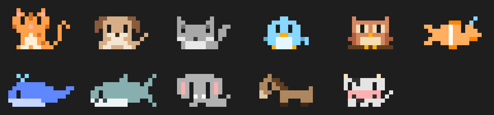
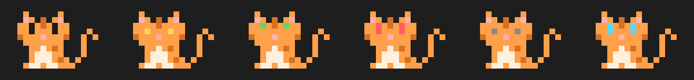

# neko ฅ(=•ω•=)ฅ

สัตว์ผู้ช่วยแบบ Jarvis นั่งเหนือช่องพิมพ์ ขยับตัวตามงานที่ Claude ทำ และคอยแนะนำระหว่างทำงาน มีให้เลือก 11 ชนิด เริ่มต้นเป็นแมวส้ม

```bash
claude plugin marketplace add sonata39-star/claude-mod   # ครั้งเดียว
claude plugin install neko@claude-mod
```

## หน้าตา

ใน terminal จะวาดเป็นภาพพิกเซลแบบตัวมาสคอตของ Claude Code โดยใช้ `▀ ▄ █` กับสีพื้นหลัง หนึ่งช่องตัวอักษรได้ 2 พิกเซล



> รูปนี้สร้างจากโค้ดที่วาดจริง ภาพในแถบจะออกมาแบบเดียวกัน

ถ้าอยากได้แบบตัวอักษรเหมือนเดิม ให้ตั้ง `style` เป็น `ascii` ใน `/config` ส่วนแอป desktop กับ VS Code จะใช้แบบตัวอักษรเสมอ:

> ตัวอย่างวาดจากผลที่ test ตรวจ บนจอจริงแต่ละตัวมีสีประจำตัว และตาเปลี่ยนสีตามอารมณ์

```
   /\_/\          เหมียว · กำลังส่อง test
  (=•ω•=)  ♡      แก้ 5 ไฟล์แล้ว commit ก่อนไหม เมี้ยว~
  ฅ( ⌕ )ฅ         t: แนะนำหน่อย  h: ซ่อน
  (")_(") ~
```

จอแคบกว่า 60 คอลัมน์จะเหลือบรรทัดเดียว: `ฅ(=•ω•=)ฅ แก้ 5 ไฟล์แล้ว commit ก่อนไหม เมี้ยว~`

### เลือกได้ 11 ชนิด

| `/neko pet …` | ชื่อเรียก | หน้า | คำลงท้าย |
| --- | --- | --- | --- |
| `cat` / แมว | เหมียว | `ฅ(=•ω•=)ฅ` | เมี้ยว~ |
| `dog` / หมา | โฮ่ง | `U(•ᴥ•)U` | โฮ่ง~ |
| `wolf` / หมาป่า | หมาป่า | ร่างพิเศษ (ด้านล่าง) | อาวู้ว~ |
| `bird` / นก | จิ๊บ | `ʚ(•v•)ɞ` | จิ๊บๆ~ |
| `owl` / นกฮูก | ฮูก | `(O,O)` | ฮู้ก~ |
| `fish` / ปลา | ปลาน้อย | `><(((•>` | บุ๋งๆ~ |
| `whale` / ปลาวาฬ | วาฬ | `( • )=<` | ฟู่ว~ |
| `shark` / ฉลาม | ฉลาม | `/(•≡)>` | งับๆ~ |
| `elephant` / ช้าง | ช้างน้อย | `((•ʃ•))` | แป๋น~ |
| `horse` / ม้า | ม้า | `/(•ᴗ•)\` | ฮี้~ |
| `cow` / วัว | วัว | `^(•(oo)•)^` | มอ~ |

ร่างเต็มบางตัว (ถือ `⌕` ตอน Claude รัน test):

```
 หมา            นกฮูก          ช้าง            วัว
   .---.          ,___,          _.-._          ^____^
  U(•ᴥ•)U        ( O,O )       (( •ʃ• ))       (•(oo)•)
  ฅ( ⌕ )ฅ        /( ⌕ )\        ∩( ⌕ )∩        ∩( ⌕ )∩
  (")_(") ⌒      ──┴─┴──        (_)─(_) ~      (_)─(_) ~

 ปลา            ปลาวาฬ              ฉลาม
        o            ,:,                 /|
       ° ⌕       .-~~~~~-.          ___/_|___
  ><(((•>       (  •  ⌕  )=<       /•  ⌕  ≡ \<
 ~~~~~~~~~~      `-.___.-´          \vvvv_____/

 หมาป่า
    ႔ ႔       ⸝    ,
 ްᠸ- -   𐅠   /    ʃ
   |  ⌕  \   ꠹    ʃ
```

ร่างดัดแปลงจาก [animal kaomoji](https://emojicombos.com/animal-kaomoji) โดยเลือกเฉพาะตัวอักษรที่ terminal วาดได้กว้าง 1 ช่อง ส่วนหมาป่าเป็นร่างที่เจ้าของ repo วาดเอง

### อารมณ์



แบบพิกเซล: ตา `-` กับ `ᴗ` คือหลับตา (ครึ่งล่าง), `^` คือยิ้ม (ครึ่งบน), แบบอื่นลืมตาเต็มช่อง ส่วนของที่ถือจะไปอยู่ตรงอุ้งเท้าหรือกลางตัว

| อารมณ์ | ตา | สีตา | ข้างหน้า |
| --- | --- | --- | --- |
| ปกติ | `• •` | ปกติ | ♡ |
| ทำงาน | `- -` | เหลือง | |
| ดีใจ (มี ♡ ♪ ลอยขึ้นแป๊บนึง) | `^ ^` | เขียว | ♪ |
| อุ๊ย (error / ถูกบล็อก) | `; ;` | แดง | ! |
| ง่วง (ว่าง 10 นาที) | `ᴗ ᴗ` | เทา | zZ |
| กำลังคิด | `• •` | ฟ้า | ? |

ตอนว่างจะกะพริบตาและกระดิกหาง (วาฬพ่นน้ำ) ทุก 3.5 วินาที

### ท่าตามงาน

| Claude กำลัง | ถือ |
| --- | --- |
| แก้โค้ด | `✎` |
| รัน test | `⌕` |
| commit | `□` |
| push | `↑` |
| ติดตั้ง package | `↓` |
| อ่านไฟล์ | `≡` |
| ค้นเว็บ | `@` |
| ส่งงานให้ agent | `»` |

## แนะนำอะไรบ้าง

**ไม่เสีย token:**
- context ≥ 80% → ชวน `/compact`
- ไฟล์ค้างไม่ commit ≥ 8 → ชวน commit
- ทำงานติดกัน 90 นาที → พักสายตา
- เลย 23:00 → ไปนอน
- test fail 3 รอบติด → ให้อ่าน error ช้าๆ

**ใช้ AI (Haiku):** ไม่เกินหนึ่งข้อต่อการสั่งงาน และเฉพาะตอนมีเรื่อง (มี error, งานนานเกิน 2 นาที, แก้ 3 ไฟล์ขึ้นไป หรือทุก 3 งาน) พูดด้วยน้ำเสียงของสัตว์ตัวที่เลือก

## ใช้งาน

| คำสั่ง / ปุ่ม | ทำอะไร |
| --- | --- |
| `/neko <คำถาม>` | ถาม ตอบโดยรู้ว่าเรากำลังทำอะไรอยู่ |
| `/neko` หรือ `t` | ขอคำแนะนำใหม่ |
| `/neko pet` | ดูรายชื่อสัตว์ทั้งหมด |
| `/neko pet <ชนิด>` | เปลี่ยนตัว ใช้ชื่ออังกฤษหรือไทยก็ได้ เช่น `/neko pet dog`, `/neko pet ปลาวาฬ`, `/neko pet random` (จำค่าข้าม session) |
| `/neko hide` / `/neko show` หรือ `h` | ซ่อน / เรียกกลับ (จำค่าข้าม session) |

มี agent `neko:advisor` ด้วย สั่ง Claude ได้เช่น "ให้แมวช่วยรีวิวงานหน่อย" แมวจะอ่านโค้ดอย่างเดียวโดยไม่แก้ไฟล์ แล้วตอบเป็นคำแนะนำเรียงตามความสำคัญ

`/neko <คำถาม>` และปุ่ม `t` ใช้โมเดลหลักของ session (ใช้ cache เดิม) ส่วนคำแนะนำอัตโนมัติใช้ Haiku

## ตั้งค่า (`/config`)

| ค่า | ค่าเริ่มต้น | ความหมาย |
| --- | --- | --- |
| `pet` | `cat` | สัตว์ตัวเริ่มต้น หรือ `random` สุ่มทุก session |
| `style` | `pixel` | `pixel` = ภาพพิกเซลใน terminal, `ascii` = วาดด้วยตัวอักษรแบบเดิม |
| `animate` | `true` | กะพริบตา กระดิกหาง หัวใจลอย |
| `autoTips` | `true` | ให้คำแนะนำอัตโนมัติด้วย AI |
| `tipModel` | `claude-haiku-4-5-20251001` | model ที่ใช้คิดคำแนะนำอัตโนมัติ |

ถ้าเปลี่ยน `pet` ใน `/config` ค่านั้นจะทับตัวที่เลือกด้วย `/neko pet` ไว้ก่อนหน้า

ตัวอักษรบางตัว เช่น `ω` `•` `♡` บาง terminal นับเป็น 2 ช่อง ถ้ารูปเบี้ยว ลองเปลี่ยน font หรือเลือกสัตว์ตัวอื่น

ภาพพิกเซลใช้ตัวอักษรกลุ่มเดียวกับโลโก้ Claude Code ถ้าโลโก้ตอนเปิด Claude Code แสดงปกติ ภาพพิกเซลก็จะแสดงปกติเหมือนกัน ถ้าภาพแตกเป็นสองเท่า ให้ปิดตัวเลือก "East Asian Ambiguous characters are wide" ใน terminal หรือตั้ง `style` เป็น `ascii`

[← กลับไปหน้ารวม](../README.md)
